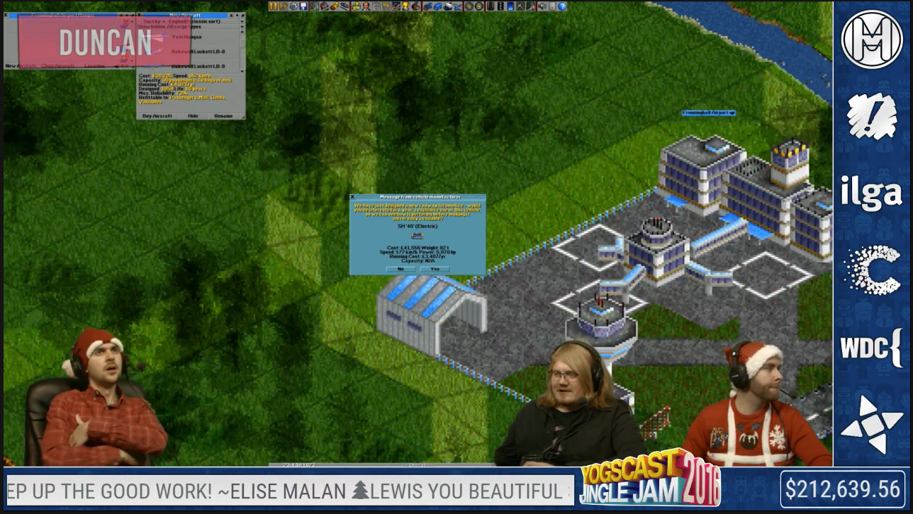

# Changelog

- Contributors
    - Stygian
    - Akhawais
    
- [12/1 - 1.0 (Launch)](#launch)

## 2016 Appearance

## 12/1 - 1.0 (Launch)
### Bug fixes
- Spreadsheets should be working now
    - Should save the daily donations at the end of each day
    - Saves the winners of raffles

### Foundation changes
- Moved jingle jam to it's own site
    - No longer on hat films site
- Updated to Laravel 5.3
- Updated to VueJs 1.0
- Updated to Laravel Echo

### New features
- Added "Mark All Donations Read" button to clear out donations before a stream.
- Added the ability update individual donations on the Bulk Edit page
- Added an assets section so Harry can update assets without needing to FTP
- Added Stream Labs support
    - Grants the ability to set custom alerts for xmas.

### Minor changes
- Changed the default search for Donation Bulk Edit to length (used to be date)
- Added edit buttons to the Manage dashboard 4 games (Goals, Raffles, Votes, Incentives)
    - Only shows up when there is an active game in the box
    
### New providers
- Added [Simple Marquee](https://github.com/IndigoUnited/jquery.simplemarquee)
    - It is located at `resources/assets/js/marquee.js`
